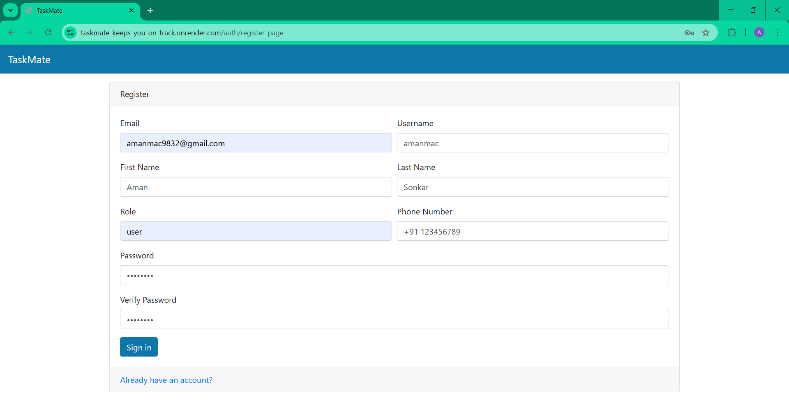
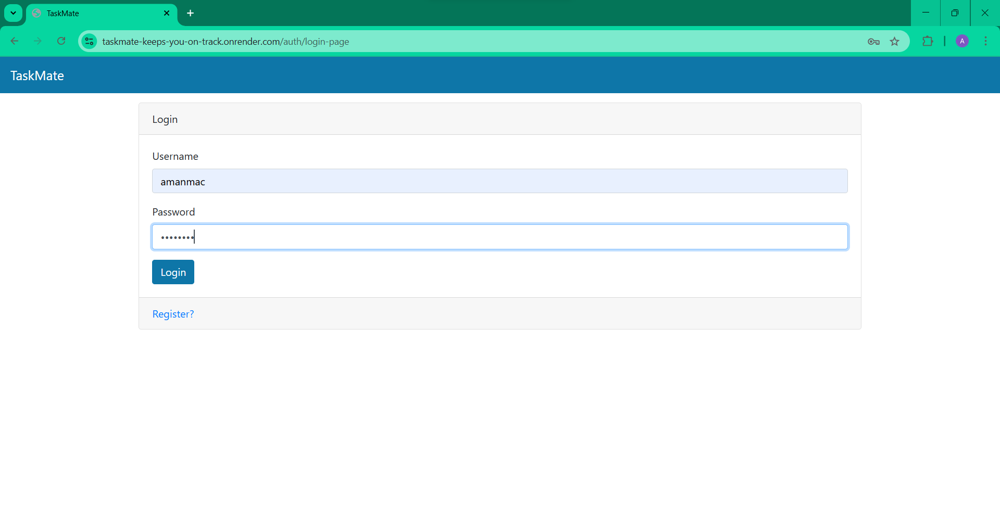
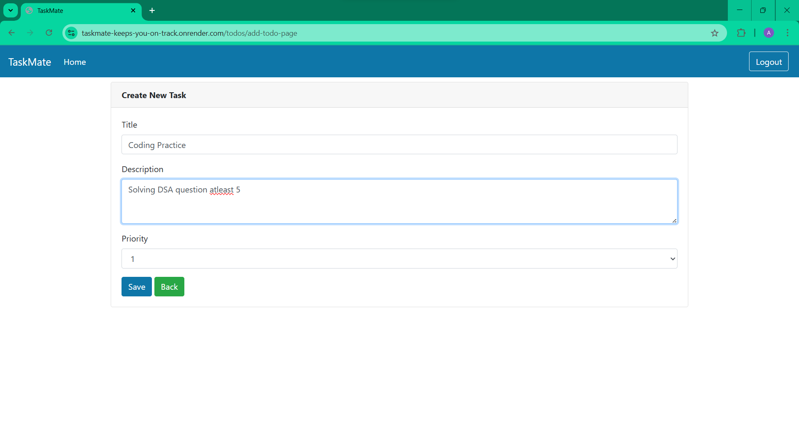
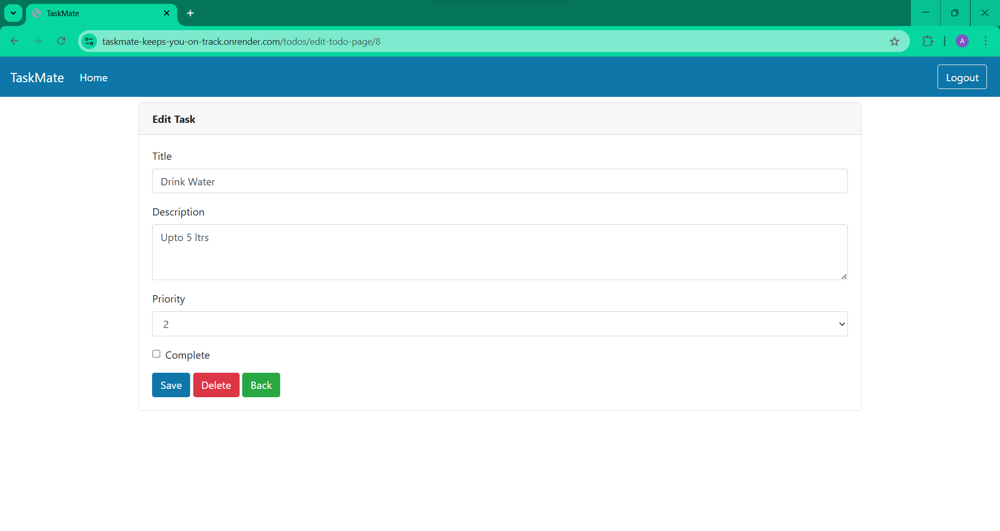
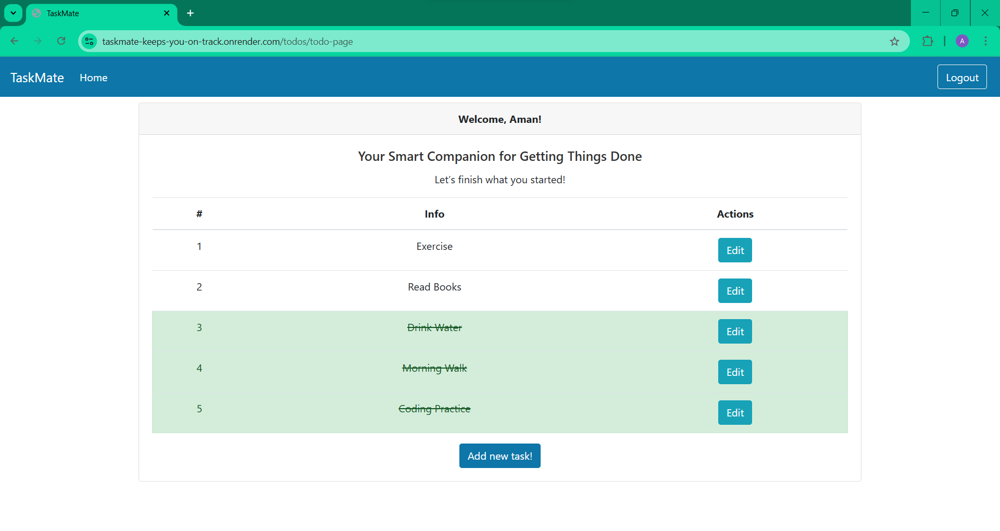

# TaskMate - Keeps You On Track!

- Available at: https://taskmate-keeps-you-on-track.onrender.com/

TaskMate is a simple, intuitive, and personalized task management web application built with **FastAPI**, **Jinja2**, and **PostgreSQL**. It helps users stay organized, track tasks, and manage priorities with ease.

---

## 🚀 Features

- 🔐 User authentication (register/login/logout)
- 📝 Create, edit, and delete personal todos
- 🎯 Set task priority and completion status
- 📱 Responsive design with Bootstrap

---

## 🛠 Tech Stack

- **Backend**: FastAPI, SQLAlchemy, PostgreSQL
- **Frontend**: HTML, Jinja2 templates, Bootstrap 4
- **Database**: Supabase (hosted PostgreSQL)
- **Deployment**: Render
- **Auth**: JWT tokens stored in cookies

---

## Project Workflow

### 1. Register Page

New users can create an account by providing their name, email, and password. Simple form validation ensures all fields are filled correctly.



---

### 2. Login Page

Registered users can log in securely with their credentials. Invalid login attempts show a helpful alert.



---

### 3. Add New Task

After login, users can add a new todo by entering a title, description, and selecting a priority from 1 to 5.



---

### 4. Edit Existing Task

Users can edit any task’s details including title, description, priority, or mark it as completed.



---

### 5. Mark Complete / Delete

Completed tasks are highlighted in green. Users can also delete tasks they no longer need to track.



---

## ⚙️ Setup Instructions

### 1. Clone the repository

```bash
git clone https://github.com/your-username/TaskMate.git
cd TaskMate

```

### 2. Set up virtual environment

```bash
python -m venv venv
source venv/bin/activate  # On Windows: venv\Scripts\activate

```

### 3. Install dependencies

```bash
pip install -r requirements.txt

```

### 4. Run the server

```bash
uvicorn main:app --reload

```
